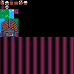

# PicoRPG

A mini-RPG built in [PICO-8](https://www.lexaloffle.com/pico-8.php).

[](https://matthurtado.github.io/PicoRPG/rpg.html)




## 🎮 About

**PicoRPG** is a retro-style role-playing game
The game is being developed in PICO-8, with features like:

- An overworld map with random encounters  
- Turn-based battle system  
- Spell learning mechanic (use **Absorb** to learn enemy spells)  
- Custom sprites, tiles, and maps  

## 🚀 Getting Started

1. Clone the repo:
   ```sh
   git clone https://github.com/YOURUSERNAME/PicoRPG.git
2. Open the cart in PICO-8
   ```sh
   pico8 run rpg.p8

## Controls

- D-Pad — Move  
- X / ❎ — Confirm / Attack  
- Z / 🅾️ — Cancel / Back  

## How to Play

- Explore the overworld and enter battles.  
- When an enemy is charging a spell, cast **Absorb**.  
  If successful, you permanently learn that spell.  


# PicoRPG Build & Run

This project uses **VS Code tasks** and [picotool](https://github.com/dansanderson/picotool) to build and run a Pico-8 game from multiple Lua source files.

## Prerequisites

- [Pico-8](https://www.lexaloffle.com/pico-8.php) installed
- Python 3.8+ installed and on PATH
- Install picotool:

```powershell
py -m pip install git+https://github.com/dansanderson/picotool.git
```

## VS Code Tasks

Open the Command Palette → `Tasks: Run Task`.

- **Build**  
  Merges your Lua sources (e.g. `src/main.lua`, `src/scenes/...`) into `build/_merged.lua`, then injects them into a cartridge using `assets/base.p8`.

- **Run**  
  Launches Pico-8 with the built cartridge (`build/rpg.p8`).

## base.p8

The build system uses `assets/base.p8` as a template cartridge that should only contain the art/music/maps/etc. When modifying any of these, open this base.p8 project in the Pico-8 editor, make your changes there, then save it in the same editor.

## Encoding / Mojibake Note

If you see strange characters (e.g. `(ヌえ🅾️)` instead of `🅾️`), this comes from hidden Unicode variation selectors.  
The build process strips these automatically when generating `_merged.lua` so the game runs correctly in Pico-8.

---

